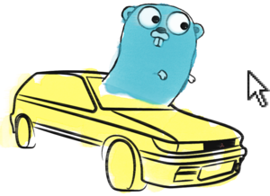

<h1 align="center">Car and Mouse</h1>
<p align="center">A Go WASM game where you lead a yellow car with your mouse</p>
<p align="center">
	
</p>

**You can see a live demo [here](https://car-and-mouse.web.app/)**


# Running locally

## To build the WASM file

```bash
make build-wasm
```

## To serve the files

```bash
go run ./scripts/server
```

Then go to [localhost:8080](http://localhost:8080)

# License

This project is licensed under the MIT License - see the [LICENSE](LICENSE) file for details
